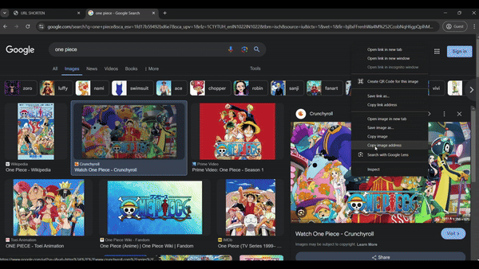

# ShortenURL

ShortenURL is a URL shortening service that allows users to create short, easy-to-share URLs from long URLs. This project is built using Node.js, Express, TypeScript, and PostgreSQL for the backend, and React for the frontend.

## Demo

 

## Features

- Shorten long URLs
- Redirect short URLs to the original URLs
- Track the number of clicks on each short URL
- User-friendly interface
- Error handling

## Download

Clone the repository:

```sh
git clone https://github.com/yourusername/ShortenURL.git

cd ShortenURL/
# run that backend
cd server
npm install
npm run dev

# run the frontend
cd client
npm install
npm run dev
```
